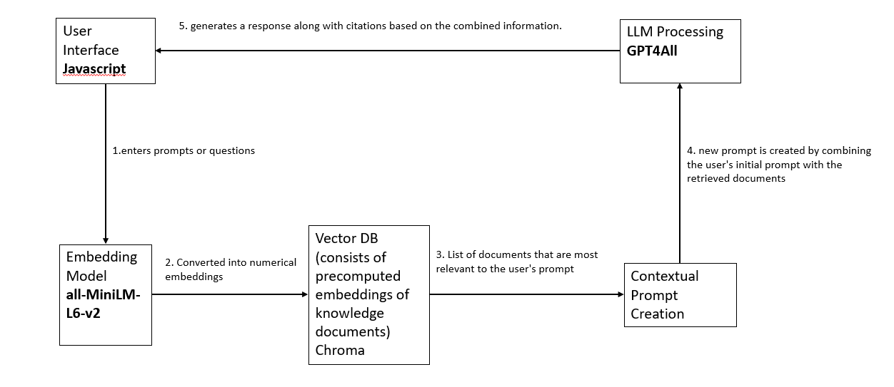

<h1>Welcome to Network Security Bot</h1>
<h2> Project Description </h2>

Build or develop a quiz bot based on a network security course using the open-source alternatives to ChatGPT that can be run on any local machine. As data privacy can be compromised when sending data over the internet, it is mandatory to keep it on local system. The bot offers two types of questions: randomly generated questions and specific topic questions, the answers should be pulled from the network security database. The bot is trained using network security quizzes, lecture slides, network security textbook. The quiz includes multiple-choice questions, true/false questions, and open-ended questions. Finally, the bot will provide feedback on the user's answers if it is correct or not along with the reference source documentation title.

<h2> System Architecture </h2>

  

  <h4>User Input:</h4>
  The user enters a prompt in the user interface.
  <h4>Embedding Generation:</h4>
  The system converts user queries into numerical embeddings, capturing the meaning of the text.
  <h4>Vector Database Query:</h4>
  The application sends the generated embedding to the vector database. 
  The vector database compares the user's embedding with precomputed embeddings of various documents. 
  It returns a list of documents that are most relevant to the user's prompt based on the similarity of their embeddings to the user's embedding.
  <h4>Contextual Prompt Creation:</h4>
  The application creates a new prompt by combining the user's initial prompt with the retrieved documents as context. 
  This step aims to provide additional information and context to the local Language Model.
  <h4>Local Language Model Processing (LLM):</h4>
  The modified prompt, containing both the user's input and relevant context documents, is sent to the local Language Model (LLM). 
  The LLM processes the contextual prompt and generates a response based on the combined information. 
  The response includes citations or references from the context documents, demonstrating the sources used to generate the answer.
  <h4>User Interface Display:</h4>
  The system presents the response along with citations in the user interface. 
  Users can view the answer and sources, ensuring transparency and credibility in the information provided.

<h2> Video </h2> 
<video width="320" height="240" controls>
  <source src="movie.mp4" type="QuizBot_Video.mp4">
  Your browser does not support the video tag.
</video>

https://github.com/harika-majji/network_security_bot/assets/145294690/faf1259b-bb3c-4530-bf70-e7473681618a
<h2> Prerequisite </h2>
Install python3 
Create virtual environment 
python3 -m venv venv 
venv/bin/activate - for MAC users 
venv/Scripts/activate - for WINDOWS users 
<h2> Requirements </h2>
*pip install langchain==0.0.274 
*pip install gpt4all==1.0.8 
*pip install chromadb==0.4.7 
*pip install llama-cpp-python==0.1.81 
*pip install urllib3==2.0.4  
*pip install PyMuPDF==1.23.1  
*pip install python-dotenv==1.0.0  
*pip install unstructured==0.10.8  
*pip install extract-msg==0.45.0 
*pip install tabulate==0.9.0 
*pip install pandoc==2.3  
*pip install pypandoc==1.11  
*pip install pypdfcd 
*pip install tqdm==4.66.1 
*pip install sentence_transformers==2.2.2  
*pip install flask

Download the <a href="https://drive.google.com/file/d/1RHfTHIZ8-N3FV4Lj_m99NYq8D4lOqgtM/view?usp=drive_link">model</a> and create a model folder and add it.

<h2> Step by step instructions for executions </h2>

•	python train.py  # only once when the application runs  
•	python ingest.py # only once until the db folder is generated with all the training data  
•	python app.py    # execute this command to run the application

<h2>Features</h2>

  Bot will generate random and specific topic quizes from trained datasets based on user requirement. 
  Bot generates different types of questions in quiz like multiple choice, true or false and open-ended. 
  Bot will provide feedback as score to user once user completes quiz. 
  Bot works both as quizbot and chatbot.  

<h2> Describe training data and data formats </h2>

We trained our bot using lecture slides and network security textbook(Network Security Essentials: Applications and Standards sixth edition - by William Stallings)

